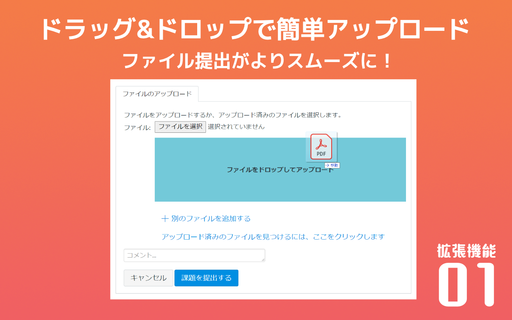
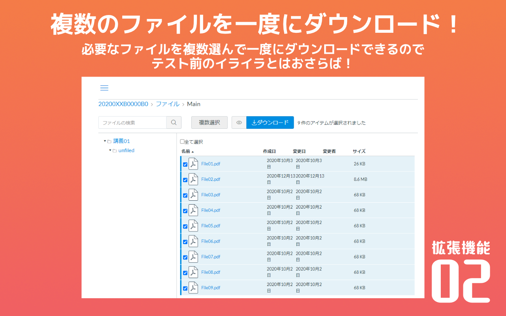

# AIMS-Gifu-extension

所属大学で運用されているLMS「AIMS-Gifu」ユーザー向けの拡張機能。
ファイルの一括ダウンロードができない！課題のアップロードが不便！みたいな、ちょっとした不便を解消する便利機能を詰め合わせた。
Chrome Web Storeにて公開中！

### ストアページ
[AIMS Gifu Extension](https://chrome.google.com/webstore/detail/drag-and-drop-extension-f/klbkinefgmmgbfgdblaflhcfobacebpn?hl=ja&authuser=0)

### 所属サークルのWebページに書いた記事
[そうだChrome拡張つくってみよう](https://prog-g.github.io/2020/11/27/%E3%81%9D%E3%81%86%E3%81%A0Chrome%E6%8B%A1%E5%BC%B5%E3%81%A4%E3%81%8F%E3%81%A3%E3%81%A6%E3%81%BF%E3%82%88%E3%81%86.html)

### イメージ

